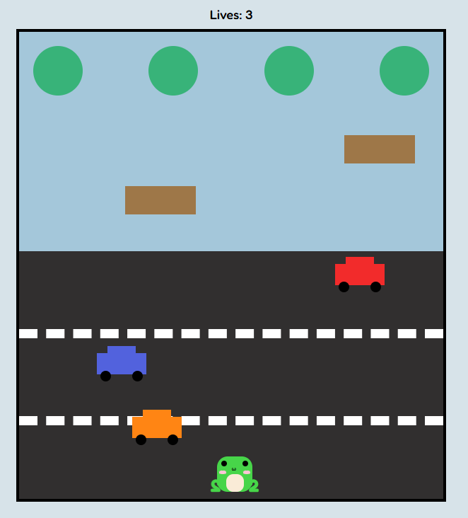
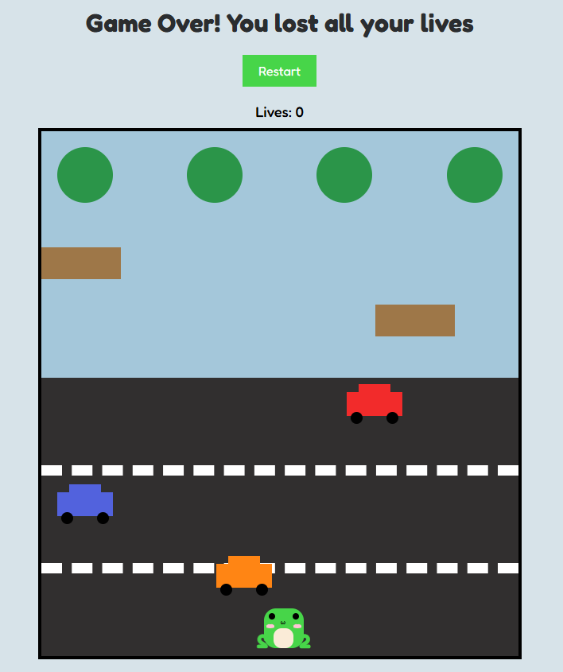
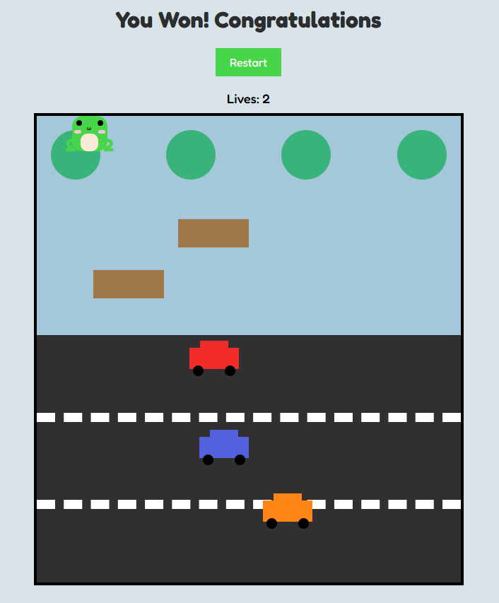

# Frogger

## Technologies Used
* HTML
* CSS
* JavaScript
* GitHub (hosting)

## Description
Guide a frog safely across a busy road and a dangours river to reach the lily pads on the other side. Dodge speeding cars, hop across floating logs, and use your three lives wisely, one wrong move and it's game over!

## user Stories
1. As a player i want to move the frog up, down,left, and right with the arrow keys to navigate on the screen

2. As a player, I want the frog to move one step per keystrock 

3. As a player I want to see cars cross the street as an obstcales 

4. As a player I want to see floaters on the river so i can cross the river 

5. As a player I should to lose if i try cross the river without floating log 

6. As a player I should lose if a car hits me 

7. As a player I have to see number of lives that I have before I lose 

8. As a player I should see game over message when I lose all my lives 

9. As a player I should win if I pass the road and the river to a safe slot

10. As a player I want to restart the game when i lose 

## Screenshots

## Future Enhancements
1. Make rounds to pass before you win
2. Add timer to make the game harder
3. Add levels for more difficulty  

## Credits
Special thanks to Mr.Omar for his assistance during the game development